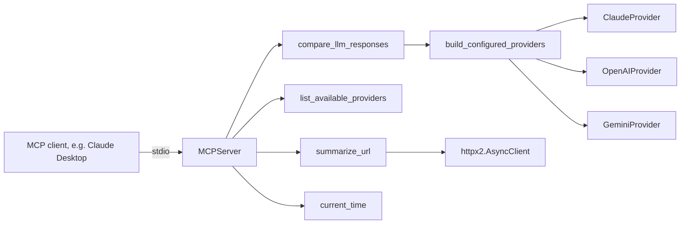

# Architecture

## Layers

**`server/main.py`** builds the `MCPServer` and registers each tool. It contains no business logic; every tool delegates to a plain function.

**`server/tools/`** holds that logic: `compare_providers` fans a prompt out to all providers with `asyncio.gather` and isolates failures, `fetch_url_summary` extracts page metadata, and `get_current_time` resolves an IANA timezone.

**`server/providers/`** holds the adapters. `LLMProvider` is the only thing the comparison logic knows about, which is why a new vendor never touches it.

## Why failures are isolated

The point of comparing providers is to see several answers at once. If one API is rate limited or misconfigured, that provider's slot carries its error message and the rest still return, so a single bad key never turns a comparison into an empty result.

## Testing approach

Adapters are tested with `httpx2.MockTransport`, asserting the exact request each vendor expects and the way its response is parsed. The server is tested twice: by calling registered tools directly, and through `mcp.Client`, which performs a real protocol handshake in memory.
